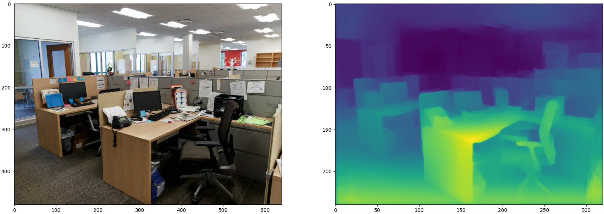

# Monocular Depth Estimation via Transfer Learning

Implemented the encoder/decoder network as described in [Alhashim and Wonka, 2019] using the provided Python template code, which we split into different parts for training, evaluation and prediction.

